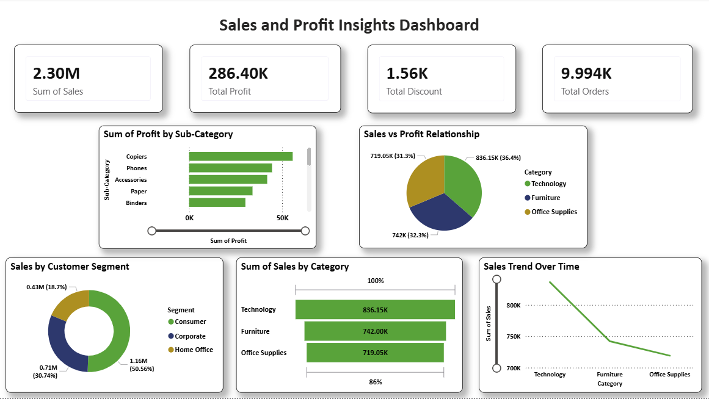

📊 Sales Performance and Profit Analysis Dashboard

📌 Project Overview
This project presents an interactive Sales Performance and Profit Analysis Dashboard created to analyze sales trends, profitability, customer contribution, and regional performance.
The dashboard helps businesses understand key metrics and make data-driven decisions.

🎯 Problem Statement
Businesses often generate large volumes of sales data, but extracting meaningful insights from this data can be challenging.
The goal of this project is to build a visual analytics dashboard that clearly presents sales performance, customer behavior, and profit distribution.

📷 Dashboard Preview

📊 Key Metrics
The dashboard highlights important business KPIs such as:

Total Sales: 2.30M

Total Profit: 286.40K

Total Quantity Sold: 38K

Total Orders: 5009

Average Discount: 0.16

🔍 Key Insights
Consumer Segment generates the highest sales contribution.

Technology Category contributes the highest profit.

Furniture Category shows lower profitability compared to other categories.

Certain sub-categories show declining profit trends.

West Region contributes the highest share of total sales.

📈 Visualizations Used
The dashboard includes multiple data visualization techniques:

KPI Cards (Sales, Profit, Orders, Quantity)

Pie Chart – Sales by Segment

Bar Chart – Sales by Category

Donut Chart – Sales by Region

Bar Chart – Sales by Customer

Line Chart – Profit by Sub-Category

Funnel Chart – Profit by Category

🛠 Tools & Technologies

Power BI

Data Visualization

Data Analysis

Business Intelligence

📚 Key Learnings

Designing interactive dashboards

Creating meaningful KPIs

Using different visualizations for insights

Improving storytelling using data

🚀 Future Improvements

Add customer churn analysis

Create time-based sales trend analysis

Include predictive sales forecasting
